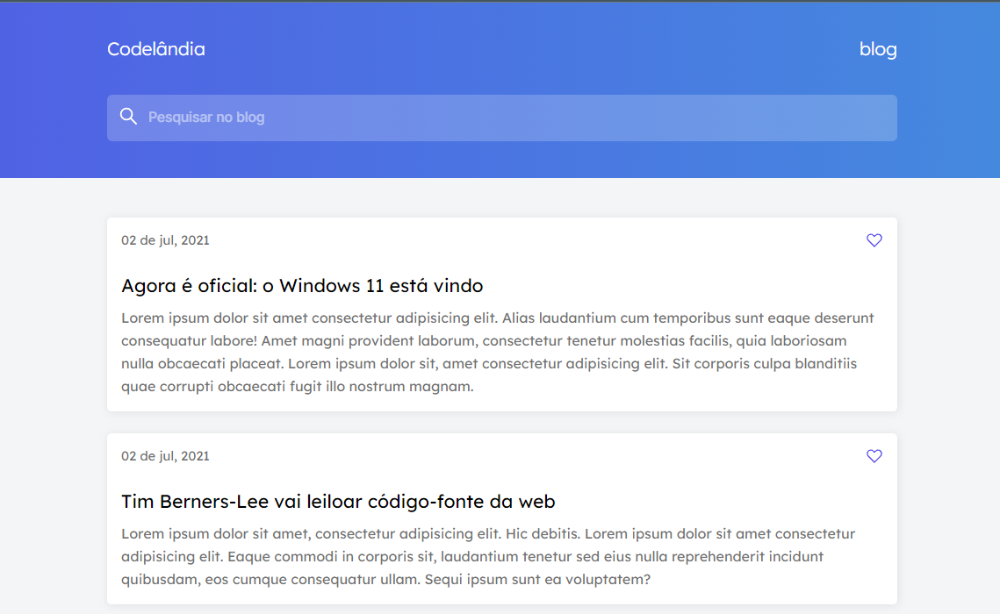

# :desktop_computer:Blog Codelândia
</img>
<h4 align="center"><a href="#" target="_blank">Acessar Demonstração</a></h4>

---

 <a href="#rockettecnologias">Tecnologias</a> •
 <a href="#framed_picturelayout">Layout</a> •
 <a href="#man_technologistautor">Autor</a>

 

# :rocket:Tecnologias

Para o desenvolvimento deste projeto utilizei as seguintes tecnologias:

   - <a href="https://www.w3.org/html/" target="_blank">HTML</a> 
   - <a href="https://www.w3.org/Style/CSS/Overview.en.html" target="_blank">CSS</a> 
   <!-- - <a href="https://developer.mozilla.org/en-US/docs/Web/JavaScript" target="_blank">JavaScript</a> -->

---

 

# :framed_picture:Layout

Layout compartilhado pelo <a href="https://github.com/iuricode">@iuricode</a> em seus desafios do discord <a href="https://discord.gg/38DSJUfe">Codelândia</a>. 
A Imagem de referência pode ser visualizada e utilizada como base de estudos através da plataforma <a href="https://www.figma.com/file/Yb9IBH56g7T1hdIyZ3BMNO/Desafios---Codel%C3%A2ndia?node-id=0%3A1">Figma</a>.

---

 

# :man_technologist:Autor 
<table>
  <tr>
    <td align="center">
      <a href="https://github.com/jefersonfagundes">
         
        
          <b>Jeferson Rosa</b>
        
      </a>
    </td>
  </tr>
</table>

